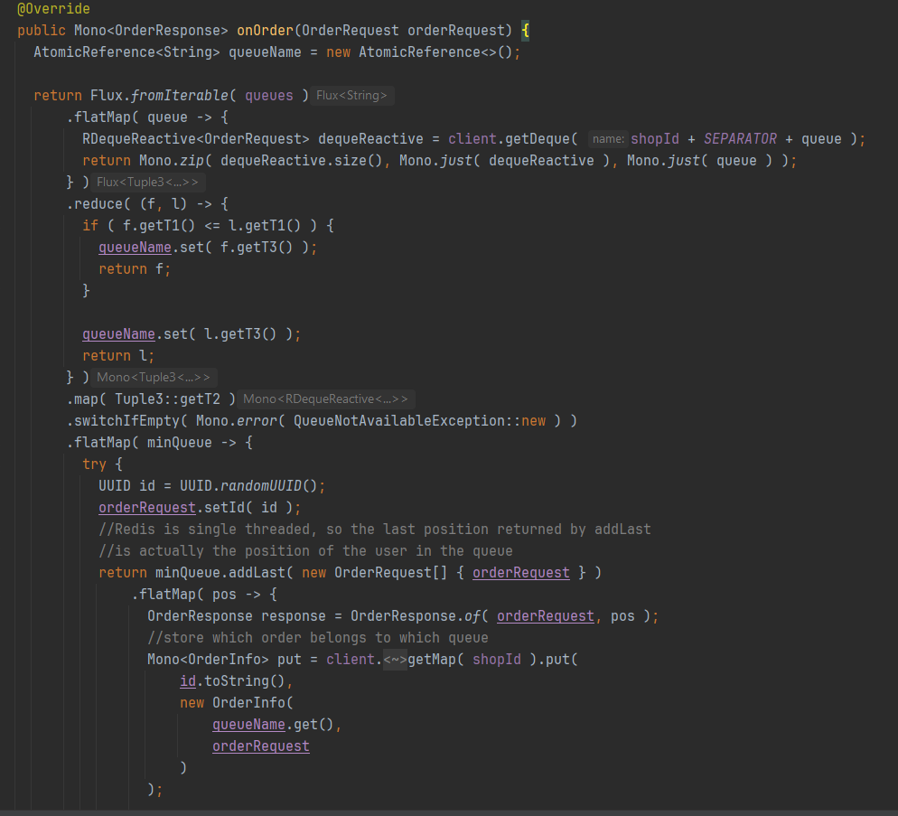
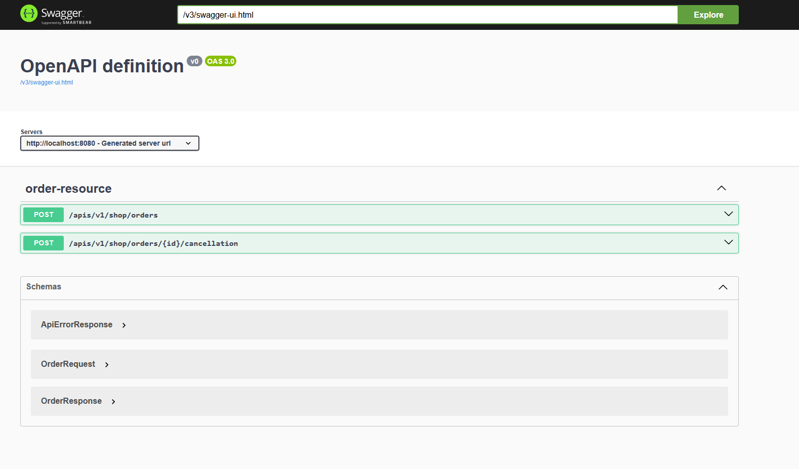

# About the project
This is a multi-modules Maven project, aim to address the requirements described for the Customer App.

## Technical things in this project:
1. RESTFul: naming convention
2. Spring: Include Spring Boot, Spring Web, Spring WebFlux, Spring Doc, **[Reactive Hibernate Spring Boot Starter](https://github.com/anaconda875/reactive-hibernate-spring-boot-starter) (my library that integrate Reactive hHibernate with Spring Data)**
3. Storage: Hibernate/JPA, PostgreSQL (locking), Redis
4. Auth: Oauth2/Keycloak
5. Migration: Liquibase
6. [Autoconfig for Liquibase](coffee-shop/src/main/java/org/example/coffeeshop/liquibase/LiquibaseAutoConfiguration.java)
7. Testing: Jmeter
8. Designing: UML
9. Deployment: docker, docker compose

## How to run:
1. Clone the repository
2. `mvn clean package`
3. `docker-compose up --build`

## Swagger:
1. Customer app: [http://35.208.232.1:8081/swagger-ui/index.html](http://35.208.232.1:8081/swagger-ui/index.html)
2. Shop app: [http://35.208.232.1:8080/v3/webjars/swagger-ui/index.html](http://35.208.232.1:8080/v3/webjars/swagger-ui/index.html)

## Structure
The project has 3 modules, each address particular requirements.
1. `org.example.common`: Contains common things like `DTO`, which are used in other modules
2. `org.example.coffee-shop`: This is a small project contains APIs for supporting the main module.
I make use of Spring Webflux and **[Reactive Hibernate Spring Boot Starter](https://github.com/anaconda875/reactive-hibernate-spring-boot-starter)**
, which is created by me, to build up the APIs.
Although the Deliverable doesn't require to implement this module, but in my point of view,
the coffee-shop should be the place in which we put the logic to, as it serve the business of the shops.

    **AND, BELIEVE ME, YOU NEED TO TAKE A LOOK AT [THIS MODULE](./coffee-shop)**.
3. `org.example.coffee-shop-customer`: The main module that solves Part 2 of the requirements.
It requires some APIs from the `org.example.coffee-shop`.

## Design (based on Deliverables Part 1)
### I. Allows the customer to register with their mobile number, name and regular address (home or work)
Although this requirement is on `coffee-shop-customer`, but think further, `coffee-shop` also has to provide `User Management/Security` feature.

To archive that, I propose using Oauth2, a standard for authorization. One of most popular Oauth2 implementation is `Keycloak`.
To integrate it to Spring Boot app, we need `Spring Security`, `Spring Oauth2 Resource Server` included in Maven/Gradle.

Our apps act as `Resource Server`, while Keycloak is an `Authorization Server`. Bellow is how a User is created:

The process of Authorization is quite simple: A `Bearer JWT token` (generated by Keycloak) have to be supplied on the Header each HTTP request sent to our apps.
The apps will check whether the token is valid or not (by invoking `JWKS URI` on Keycloak). If the token is invalid, `401` or `403` will be returned.

How it works? Basically, `Spring Security` will set up a `FilterChain` to filter incoming HTTP request.

### II. Allows the customer to view and find the coffee shops closest to them
I propose using `Google Map APIs` to fulfill this requirement. The detail is bellow:

### III. Place an online order for a coffee from the menu
This is the main feature of ours apps. It must work correctly in concurrent situations.
We have some options for this case:
1. Using `Optimistic Locking` supported by Hibernate/JPA:

- The table `order` will have a Integer field annotated by `@Version`.
- Whenever a transaction want to commit an order, the application compares the `entity version` with the `in-DB version`.
If they do not match, mean there is/are other transaction(s) committed before, so the version get increased.
In this case, an Exception will be thrown.
If they match, mean is no other transaction committed before. The current transaction will increase the version and do commit.

2. Using Redis along with Redisson library:

Since Redis is single threaded, there is no multiple write at a particular timestamp, so concurrent issue is not happened.
We can use `Redis List`, which is backed by `Redisson Queue` to store the orders. First in first out!

In the scope of this assessment, I use `Option 2` (detail [HERE](/coffee-shop/src/main/java/org/example/coffeeshop/service/DefaultOrderService.java))
![https://plantuml.github.io/plantuml-core/raw.html?ZLB9JiCm4BtdAnuzWKGZiQC8LK8Wf4f854fllRZ9jF71Tl02uk-n7P9cwQ4NonwFtp9-9xOaGH1CcwHYslASLqnQh0pfNk796Qi4wSUgEbXVbgeQtdrGmVkm2sLscfRlhqd2Sik_cQMQAYoOpheq6IvIBDr6S8l9cov8JvA2-i_QKrTUPz-5_5UOuTB3aYmGCQ7fov6nNUWksAZO61sS3n5TfNZXdiZF69x44NvAdfSecO7WaWid89tOU1Lg2-SDcRKytVp61m5bNfo1UO0TIT911CDgDN_6LkdO4nqCbGJFSV8PhbCidDstDcPXrLxKMWOA3w493tKRByx_7t2vLRD3isd6q5xKdntNwNWOo72JujDpLifmovKCbaV2kamruB7p3wxRT6MuzNyyT1Gp5ZQvqvfy6Xifip7OC8ftQIlKL4eQEcecCQEzE7hSKCnmVmnW01j4_Wy0](./images/order.png)

### IV. See their position in the queue (and expected waiting time before collecting the coffee)!
We could make a table to store the expected waiting time for each item on the menu:

| id | item_id | waiting_time | 
|----|---------|--------------|
| 1  | 12      | 5 (minutes)  |
| 2  | 13      | 10 (minutes) |

And a table to store the current position of the particular user:

id |               order_id               | position |               user_id                
---|--------------------------------------|----------|--------------------------------------
51 | 48f2554c-ef29-4d46-a8bd-632eaf8ae03e |        5 | bda05e7d-65c5-4988-b0b3-d70f261227cb
52 | 2051ac86-3ea9-45ae-8a2e-0b427d0ff14b |        6 | bda05e7d-65c5-4988-b0b3-d70f261227cb

When someone check his/her position, we pull records from two table and orders before the current position of the user
(for example, if user has position of 4, we pull order 1, 2, 3). Then we calculate the total waiting time and return them to the user 
(detail [HERE](coffee-shop/src/main/java/org/example/coffeeshop/service/DefaultOrderService.java)).

![https://plantuml.github.io/plantuml-core/raw.html?dLF1KeCm4Btp5Mjx9cej7ZWuetMSSSPfhRKtBmnP8LD8OhAn-lU6MYXG71ql8LdWlRTlNquennAXJ8mDT698f48dac1jqNGACsT9bMYkjHwihtAb--yUbSqChfOFGP2a9DuJmc_WQe7mgWqQmpc3MI7I3OncEVg7LbQGK78KSEp-tfpQebhxDlHULmmJ1YkK74QdgJC69OKD0HXySsZfHTxBj70SOM6uLoXucxfDTbIis--TAoMD2p5SC5WwD9_WNVUagJ8Sjhb8Spy0ycj3s-0VB6ns40wrDwsX3LfNK5lu0MEubuB6cIeuZ0kHvQI5tC1SrV9UbPFykAt-y2BcnpSzcy9yyGntY_NyDi32uXxJqwEi4V53MBA_E1MnITtGDl5Jabb8egnDi_ymA6BU_HuMEIEH3tireEy8yyO9xzlUyJzu535usdryuFQH70fPdQVUnUc4tEDNnHWkMQLxb-LAZ5RIua_9xTsbBm00](./images/position.png)

### V. Exit the queue at any time
When the user want to cancel his/her order, the `coffee-shop-customer` app will make a http call to the `coffee-shop`
include `order id`. Then we can use it to remove everything from the `Redis`, `PostgreSQL`
![https://plantuml.github.io/plantuml-core/raw.html?XLBBRi8m4BpdAxRXIjC7q4CEbIegf4eL52WtBgcz91QEdTeEBNzVEoyCHEfbPQ-zCxipUsCop17oHEcWI9HXX1M9CB3HgCuIqr8RcQDwAOhU_3gJnUNR2YaxX_sGsgGArylt84Y8OOV4OCtb0jm--pmnF4GmvOpi8PmcWY07gIYgCA1uNjpT_2wzim_SD1h3OmHh51J2ErA1yyGmAK9G-5sYDbln9WWlASB2aGAZFgrFT9LijRYukougIM8OHJ1ZbjkgtyABdOIVZ97Ccc5ix5Wx-5hEAi9jtqJZ29ObggCTGPVS-FtMjVtjSpD89QSmu2pDJC747kRIOX2hDknaAUZr99TEJIBhrVX-3FF59ymMc_chhx_xxeoAuUdw7tAD3RTT3HGjC_uoRNGlTQFY9B8UpfJCAnthiY6aQAgxTR74uLROiyFCvG6RVvM_i7E5pFnBiAfBFPk-ZYTt-gfFM-uWHXs4pJEtO-s4FexTnBxzQc3_0000](./images/exit.png)

### VI. Spring doc

